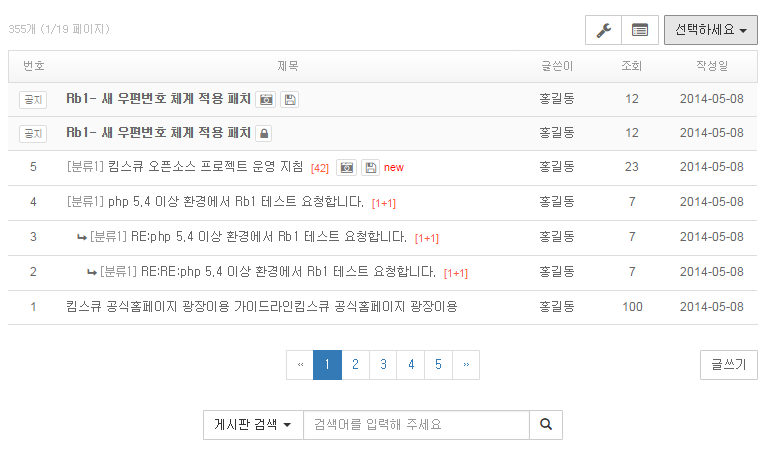
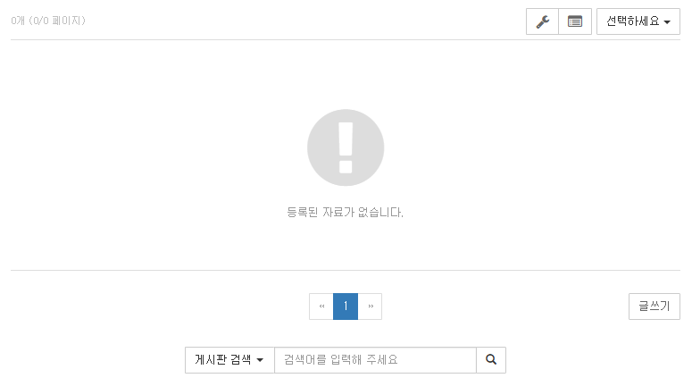

# BBS template(table-classic)

### summary
* 테이블형 기본 게시판 템플릿

### Feature
* Based on Bootstrap v3.3.5

### Plugins
* [jQuery](https://jquery.com/)
* [Bootstrap](http://getbootstrap.com/)
* [Bootstrap-selcct](http://silviomoreto.github.io/bootstrap-select/)
* [jquery-cookie](https://github.com/carhartl/jquery-cookie)

### Reference 
* [simple-jquery-text-resizer](http://trevordavis.net/blog/simple-jquery-text-resizer/)

### DEMO
* [목록 list](http://gitaeks.github.io/bs-html-examples/bbs/table-classic/list.html)
* [목록 list-nopost](http://gitaeks.github.io/bs-html-examples/bbs/table-classic/list-nopost.html)
* [보기 view](http://gitaeks.github.io/bs-html-examples/bbs/table-classic/view.html)
* [쓰기 write](http://gitaeks.github.io/bs-html-examples/bbs/table-classic/write.html)

### Screenshot

--

